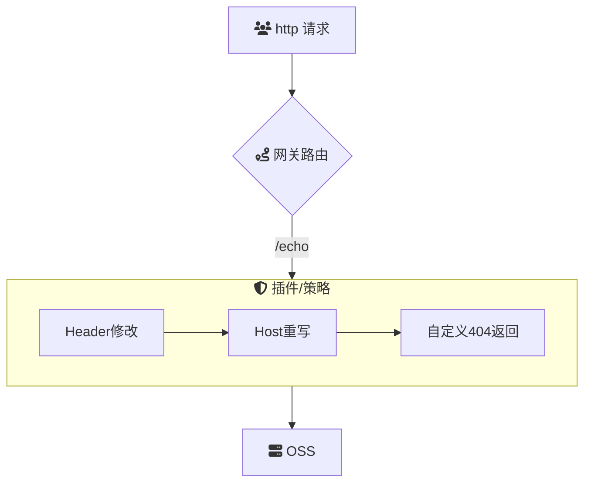

# 概述
**基于云原生 API 网关和阿里云 OSS 实现前端网站托管**

基于云原生 API 网关与阿里云对象存储服务（OSS）相结合的前端网站托管解决方案，旨在提供高性能、高可用、安全且易于管理的静态和动态内容交付。该架构充分利用 API 网关的流量管理和安全控制功能，以及 OSS 的高可靠性和全球分发能力，实现前端网站在现代云环境中的高效运行和管理。

通过整合云原生 API 网关与阿里云 OSS，实现前端网站的高效托管和内容交付。该方案结合 API 网关的智能路由、流量控制和安全策略，与 OSS 的弹性存储和全球内容分发网络（CDN）能力，满足前端网站在性能、扩展性和安全性方面的多样化需求，为企业和开发团队提供一个可靠且灵活的托管平台。

### 场景描述
在数字化转型加速和用户体验要求不断提升的背景下，前端网站面临着高并发访问、快速迭代、安全防护和全球覆盖等多重挑战。传统的前端托管方式往往难以在性能和安全性之间取得平衡，且扩展性和维护成本较高。基于云原生 API 网关和阿里云 OSS 的前端网站托管解决方案，通过将流量管理、安全控制和内容存储分离，提供了一种高效、可扩展且安全的托管方式，满足现代前端开发和部署的需求。

### 应用场景
1. **企业官网与品牌展示**：
   - 利用 OSS 存储高质量的静态资源，如图片、视频和文档，通过 API 网关进行统一的流量管理和安全监控，提升访问速度和品牌形象。
   
2. **电子商务平台**：
   - 托管前端静态资源（如商品图片、CSS、JavaScript）在 OSS 上，结合 API 网关的流量控制和安全策略，确保高并发访问下的稳定性和安全性，防止恶意攻击和数据泄露。
   
3. **单页应用（SPA）**：
   - 将前端应用部署在 OSS，通过 API 网关进行 API 请求的路由和管理，实现前后端分离架构的高效协作和性能优化。
   
4. **内容管理系统（CMS）**：
   - 静态内容（如文章、媒体文件）存储在 OSS 中，通过 API 网关实现内容的动态分发和访问控制，确保内容的及时更新和安全访问。
   
5. **开发者文档与知识库**：
   - 部署在 OSS 上的文档内容，通过 API 网关实现权限控制和访问统计，确保文档的安全性和高可用性。
   
6. **个人博客与作品集**：
   - 将博客和作品集的静态文件托管在 OSS，通过 API 网关配置自定义域名和 HTTPS，提供安全快速的访问环境，提升用户体验。
   
### 解决问题
- **高性能与低延迟**：
  利用阿里云 OSS 的高性能存储和 CDN 全球加速能力，结合 API 网关的智能路由和缓存策略，实现前端资源的快速加载和高效分发，提升用户访问速度和体验。
  
- **高可用性与可扩展性**：
  基于云原生架构，API 网关和 OSS 的分布式特性确保系统在高并发访问下依然保持高可用和高性能，支持自动扩展以应对流量波动。
  
- **安全性提升**：
  通过 API 网关实现访问控制、身份认证、DDoS 防护等安全策略，保护前端资源和用户数据的安全，防止未授权访问和恶意攻击。
  
- **简化运维管理**：
  云原生 API 网关提供统一的流量管理和监控接口，结合 OSS 的自动化存储管理，简化前端网站的部署、监控和维护过程，降低运维复杂性。
  
- **成本优化**：
  利用 OSS 的按需付费和高效存储优化方案，结合 API 网关的资源管理能力，实现前端网站托管的成本优化，适应不同规模的业务需求。
  
- **灵活的配置与集成**：
  通过 API 网关的可编程接口和丰富的插件支持，实现对前端网站的灵活配置和功能扩展，如自定义域名、HTTPS 配置、动态请求处理等，满足多样化的业务需求。
  
- **增强用户体验**：
  通过高效的内容分发和低延迟的访问速度，提升终端用户的访问体验；同时，借助 API 网关的流量控制和监控能力，确保网站的高可用性和响应速度。
  
- **支持持续集成与部署**：
  结合 DevOps 工具链，通过自动化脚本和 CI/CD 管道，将前端内容的更新和发布流程自动化，实现快速迭代和持续交付，提升开发效率和响应市场变化的能力。

## 架构

## 部署

## 使用